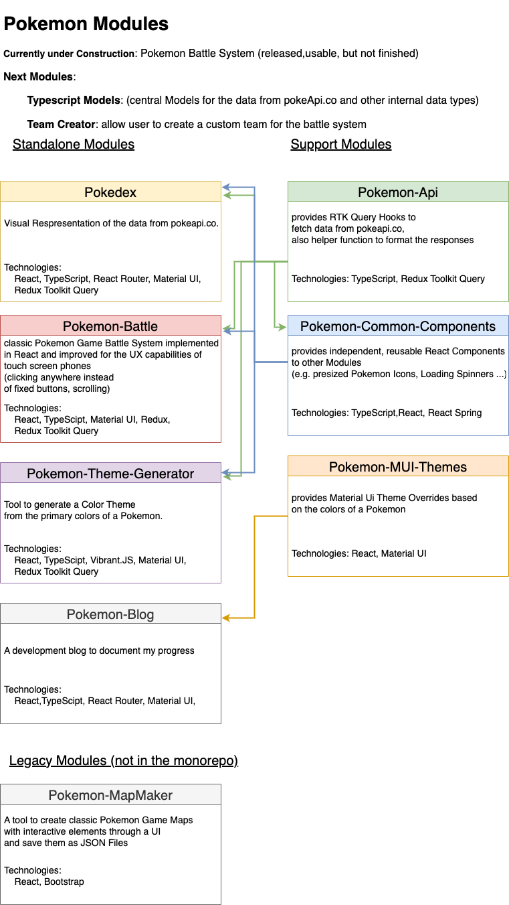

# pokemonModules

## Latest Release: 
### Battle System: picking random moves the pokemon can learn, instead of first four
### Battle System: let opponent AI pick random move

## Next Release: 
### Battle System: Status Condition Sleep

## Overview:

To showcase and improve my skills as an advanced frontend developer, i want to create one large continuous project, instead of multiple small ones.

Pokemon is perfect for this, because of the topics extensive data and possible functionalities. For example remaking the battle system using frontend state handling).

"Standalone" Modules can consume support modules and can also be deployed. 

It is also possible to import "Standalone" Modules into other "Standalone" Modules, to create larger applications.

For example, the pokedex module will be integrated into any future module in which the user might need information about a Pokemon.

## Standalone Modules:

### Pokedex
https://pokemonmodules-pokedex.netlify.app/

### Battle System (designed for sideways smartphone, responsive for Desktop, but not too pretty)
https://pokemonmodules-battlesystem.netlify.app/

### Color Theme Generator
https://pokemonmodules-theme-generator.netlify.app/

### Blog and Documentation
https://pokemonmodules-blog.netlify.app/

## Legacy Modules:
These are older Projects that will soon be refactored and integrated into the monorepo.

### Map Maker
https://pokemonmodules-mapmaker.netlify.app/

github: https://github.com/chriskuhtz/pokemonMapMaker

